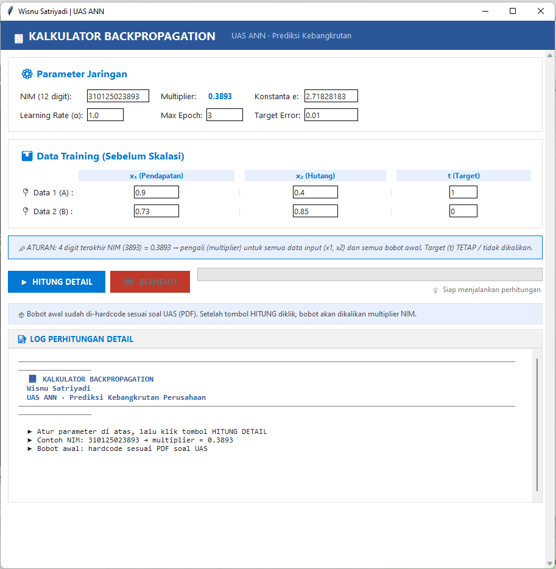

# 📘 Kalkulator Backpropagation (UAS Artificial Intellegence)

Aplikasi GUI interaktif berbasis Python/Tkinter untuk mensimulasikan Jaringan Syaraf Tiruan (JST) menggunakan algoritma **Backpropagation**. 
Proyek ini dibuat untuk tugas akhir semester (UAS) mata kuliah Kecerdasan Buatan: **Prediksi Kebangkrutan Perusahaan**.



## ✨ Fitur Utama

- **GUI Terang & Modern** — Terinspirasi dari tema Microsoft Word (bersih, rapi, dengan highlight biru).
- **Hardcode Initial Weights** — Bobot awal jaringan ($v$ dan $w$) sudah di-hardcode sesuai dengan PDF soal UAS.
- **Konversi NIM ke Multiplier** — Input 12 digit NIM; 4 digit terakhir diekstrak menjadi nilai *multiplier* desimal (contoh: NIM `...3893` menjadi multiplier `0.3893`).
- **Skalasi Otomatis** — Fitur yang otomatis mengalikan data input ($x_1$, $x_2$) dan bobot awal dengan *multiplier* NIM. (Target $t$ tetap).
- **Detail Log Real-time** — Menampilkan hitungan step-by-step per Data (Forward Pass, Backward Pass, Update Bobot, dan Error).
- **Multi-Threading** — Perhitungan berat (epoch tinggi) tidak akan membuat UI macet (lag).
- **Target Error (MSE)** — Perhitungan dapat berhenti otomatis jika MSE di bawah target error yang diset.
- **Berhenti Paksa** — Tombol untuk menghentikan loop komputasi di tengah jalan.

## 🚀 Cara Menjalankan Aplikasi

Aplikasi ini menggunakan `tkinter` yang merupakan *standard library* Python. Anda tidak perlu menginstall *dependencies* GUI tambahan, cukup jalankan menggunakan versi Python 3.7 ke atas.

1. Clone repositori ini atau download source code:
   ```bash
   git clone https://github.com/wsatriyadi/uas-kecerdasan-buatan.git
   cd uas-kecerdasan-buatan
   ```

2. Jalankan aplikasi:
   ```bash
   python main.py
   ```

## 🏗️ Struktur Jaringan Syaraf Tiruan

Jaringan ini didesain untuk **Prediksi Kebangkrutan Perusahaan** (Data 1 = Perusahaan A, Data 2 = Perusahaan B):
- **Input Layer:** 2 Neuron ($x_1$ untuk Pendapatan, $x_2$ untuk Hutang)
- **Hidden Layer:** 4 Neuron ($z_1, z_2, z_3, z_4$)
- **Output Layer:** 1 Neuron ($y$ untuk Target prediksi)
- **Fungsi Aktivasi:** Sigmoid (pada hidden dan output layer)
- **Parameter Default:** 
  - Learning Rate ($\alpha$) = 1.0
  - Konstanta e = 2.71828183

## 📝 Format Output (Log)

Setiap klik **Hitung Detail**, log akan mencetak langkah per langkah layaknya hitungan tangan:
1. **Skalasi:** Menampilkan bobot $v, w$, dan data setelah dikalikan NIM.
2. **Forward Pass:** Menghitung nilai aktivasi $z_{in}$, $z_{out}$, $y_{in}$, dan $y_{out}$.
3. **Error:** Menghitung error dan MSE (Mean Squared Error).
4. **Backward Pass:** Menghitung faktor delta ($\delta$) dan update bobot input-hidden & hidden-output ($\Delta v$, $\Delta w$).

---
*Dibuat untuk keperluan akademik (UAS AI)*
*Wisnu Satriyadi*
*NIM : 310125023893*
